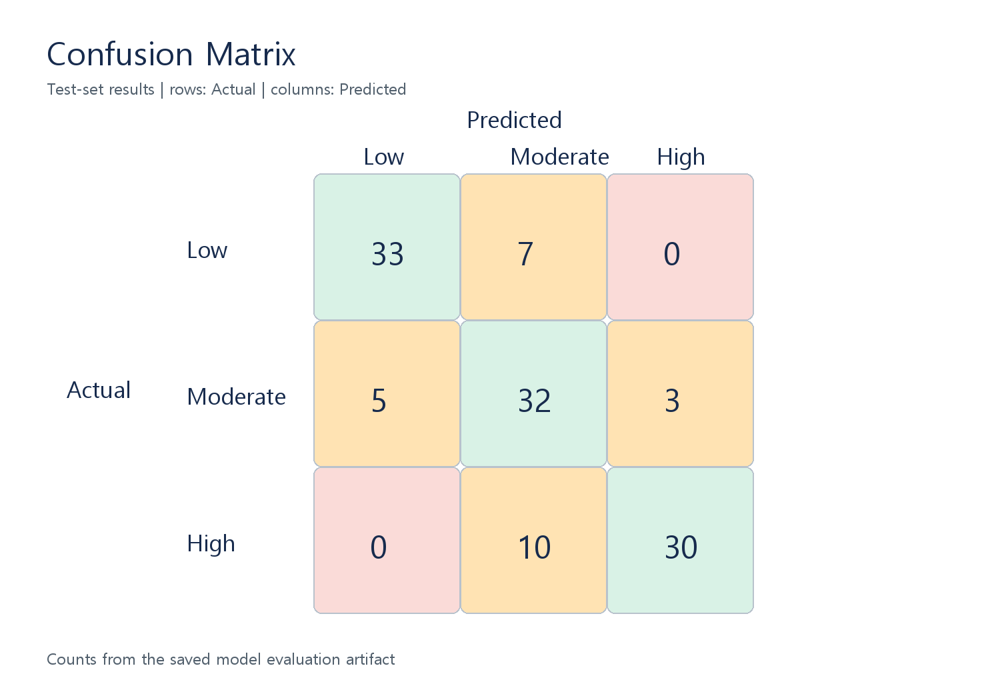
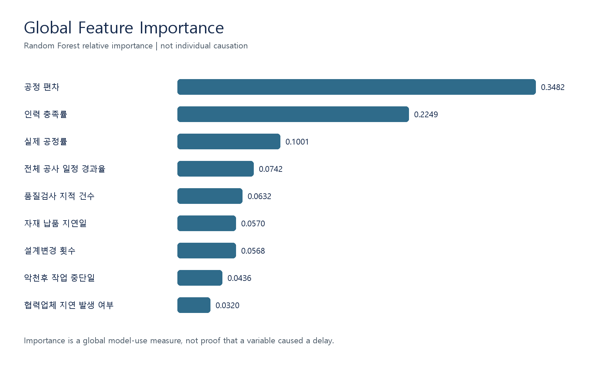

# BuildDelay AI

건축공사 현장의 진행 상태와 위험요인을 입력하면 일정 지연 위험도를 `Low(정상)`, `Moderate(주의)`, `High(지연 위험)`으로 분류하는 교육용 Streamlit 프로젝트입니다.

## Live Demo

[BuildDelay AI Streamlit Live Demo](https://builddelay-ai.streamlit.app/)

## 프로젝트 개요

실제 건설현장 데이터를 확보하기 어려운 과제 환경을 고려해, 재현 가능한 규칙 기반 가상 데이터 600건을 생성하고 Random Forest 분류 모델을 학습했습니다. 사용자는 8개 현장 변수를 입력하고 공정 편차, 예측 등급, 모델 Confidence, 클래스별 예측 확률, 현재 입력에서 확인되는 위험요인을 확인할 수 있습니다.

> 본 앱은 건축공학 AI 수업을 위한 교육용 분석 도구입니다. 실제 건설현장의 공정관리나 의사결정을 대체하지 않습니다.

## 기술 스택

`Python` · `Streamlit` · `pandas` · `NumPy` · `scikit-learn` · `joblib` · `Plotly`

## ML Pipeline

```text
합성 현장 데이터 600건
        ↓
공정 편차 계산 및 위험점수 기반 라벨 생성
        ↓
80/20 stratified train/test split
        ↓
RandomForestClassifier(n_estimators=200, random_state=42)
        ↓
Low / Moderate / High 예측 + predict_proba()
        ↓
Streamlit 대시보드
```

입력 feature는 전체 공사 일정 경과율, 실제 공정률, 인력 충족률, 자재 납품 지연일, 악천후 작업 중단일, 설계변경 횟수, 품질검사 지적 건수, 협력업체 지연 여부입니다. 여기에 `공정 편차 = 실제 공정률 - 전체 공사 일정 경과율`을 파생 feature로 추가합니다.

데이터와 라벨은 실제 관측값이 아닌 교육용 합성 데이터입니다. 지연 요인이 증가할수록 잠재 위험점수가 커지도록 설계하고, 고정 seed `42`로 재현성을 확보했습니다.

## 실제 테스트 성능

독립 테스트셋 120건에서 실제 실행한 결과입니다.

| 지표 | 결과 |
| --- | ---: |
| Accuracy | **79.2%** |
| Macro Precision | **81.0%** |
| Macro Recall | **79.2%** |
| Macro F1 | **79.6%** |

### Confusion Matrix

행은 실제 클래스, 열은 모델 예측 클래스입니다.



Low와 High 사이의 직접 오분류는 0건입니다. 실제 High 40건 중 30건은 High로 분류되었고, 10건은 Moderate로 분류되었습니다. Moderate는 실제 Moderate 40건 중 32건을 맞혔으며 Low·High 양쪽과 일부 혼동되어 세 등급 사이의 경계 클래스처럼 나타납니다. 이는 이 합성 데이터와 현재 모델 평가에서 관찰된 패턴이며, 실제 현장의 일반 법칙을 의미하지 않습니다.

### Global Feature Importance

저장된 Random Forest의 실제 `feature_importances_`를 내림차순으로 표시했습니다.



현재 모델의 상위 feature는 다음과 같습니다.

1. 공정 편차 — 0.348172
2. 인력 충족률 — 0.224934
3. 실제 공정률 — 0.100126
4. 전체 공사 일정 경과율 — 0.074173

이 값은 전체 학습 데이터에서 모델이 feature를 분할에 활용한 상대적 중요도입니다. 개별 예측의 직접 원인이나 인과관계로 해석하지 않습니다.

## 샘플 결과

저장 모델에 동일한 입력을 넣은 실제 결과입니다.

| 샘플 | 입력 요약 | 예측 | Confidence | 공정 편차 |
| --- | --- | --- | ---: | ---: |
| 정상 | 40 / 43 / 98 / 0 / 1 / 0 / 0 / 없음 | **Low** | 98.5% | +3%p |
| 주의 | 60 / 52 / 82 / 4 / 3 / 2 / 1 / 없음 | **Moderate** | 57.0% | -8%p |
| 고위험 | 75 / 48 / 65 / 15 / 8 / 5 / 4 / 있음 | **High** | 99.5% | -27%p |

입력 순서: 일정 경과율 / 실제 공정률 / 인력 충족률 / 자재 지연 / 악천후 / 설계변경 / 품질 지적 / 협력업체 지연.

## Confidence의 의미

화면의 Confidence는 Random Forest의 `predict_proba()`가 해당 입력을 각 클래스에 배정한 상대적 예측 확률입니다. 실제 공사가 지연될 확률, 실제 위험 확률, 또는 모델 Accuracy를 뜻하지 않습니다.

## 실행 방법

```powershell
pip install -r requirements.txt
python generate_data.py
python train_model.py
streamlit run app.py
```

## 프로젝트 구조

```text
builddelay-ai/
├── PRD.md
├── AGENTS.md
├── app.py
├── generate_data.py
├── train_model.py
├── requirements.txt
├── data/construction_delay_dataset.csv
├── model/delay_classifier.joblib
└── report/images/
    ├── confusion_matrix.png
    └── feature_importance.png
```

## 보고서용 스크린샷

다음 앱 화면은 Live Demo에서 직접 캡처해 추가할 수 있습니다. 자동 캡처를 위해 무거운 dependency는 추가하지 않았습니다.

- `report/images/app_overview.png`
- `report/images/prediction_low.png`
- `report/images/prediction_moderate.png`
- `report/images/prediction_high.png`

## 한계

- 데이터와 라벨이 실제 건설현장 관측값이 아닌 합성 데이터입니다.
- 모델 성능은 실제 산업 현장 성능이 아니라 합성 데이터 생성 규칙을 재현하는 정도를 나타냅니다.
- 계약, 공법, 프로젝트 규모, 공급망, 발주자 의사결정 등 입력에 포함되지 않은 요인이 실제 일정에 영향을 줄 수 있습니다.
- 따라서 본 결과를 실제 공정관리 또는 의사결정 기준으로 사용해서는 안 됩니다.
